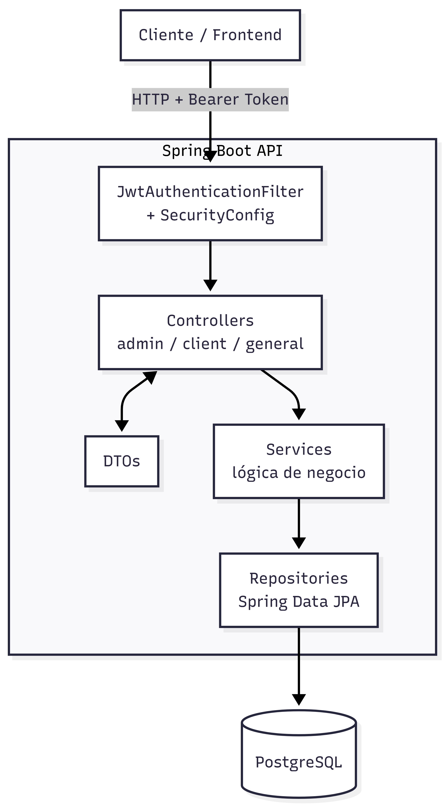
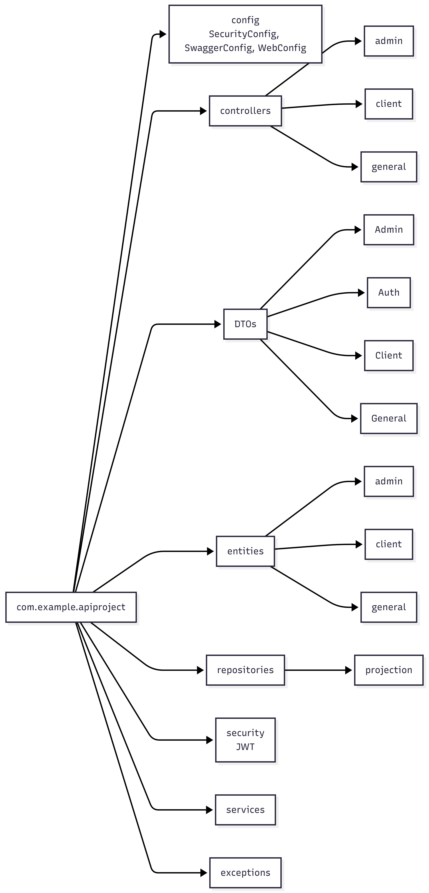
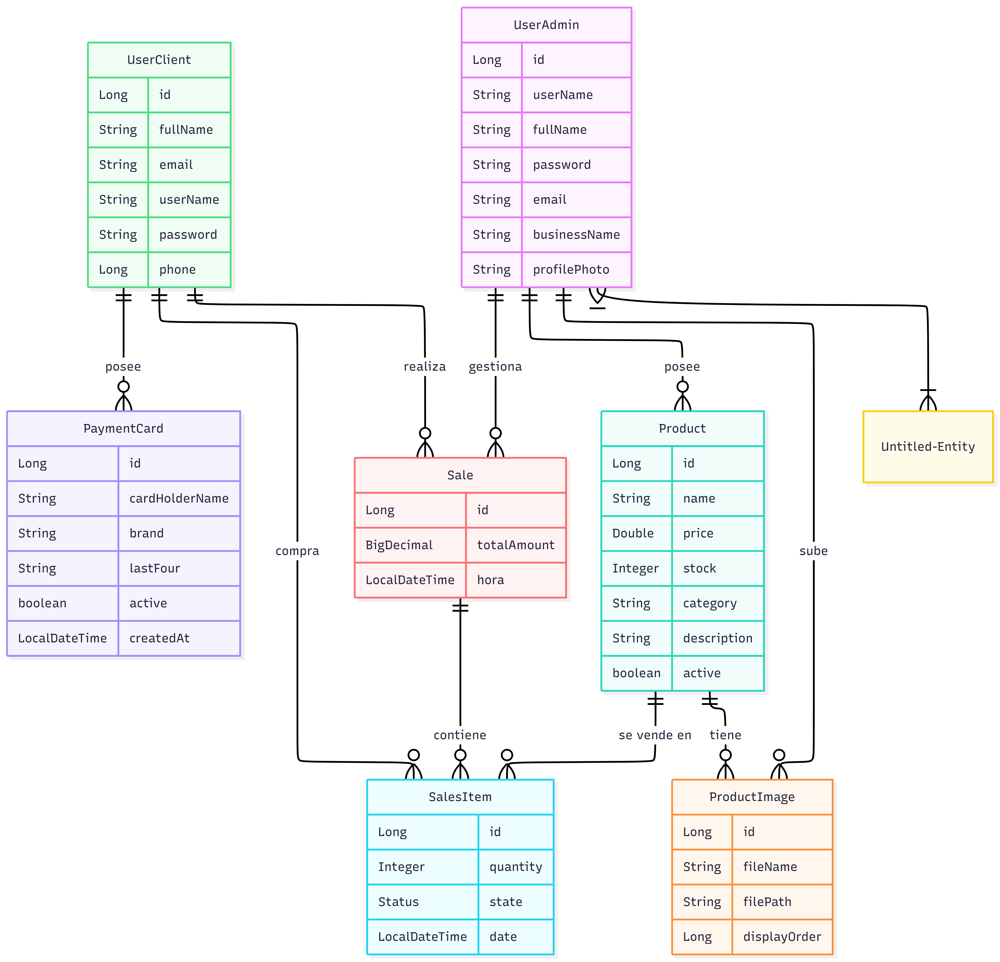

# Api-Project — API de Inventario y Ventas
 
API REST para gestión de inventario, ventas y clientes, con autenticación JWT y dos roles de usuario: **Admin** y **Client**. Construida con Spring Boot 3 y PostgreSQL.
 
## Stack tecnológico
 
| Componente | Tecnología |
|---|---|
| Lenguaje | Java 21 |
| Framework | Spring Boot 3.4.4 |
| Seguridad | Spring Security + JWT (jjwt 0.11.5) |
| Persistencia | Spring Data JPA + PostgreSQL |
| Documentación API | springdoc-openapi (Swagger UI) |
| Tiempo real | Spring WebSocket / SSE (notificaciones) |
| Build | Maven (con wrapper `mvnw`) |
| Utilidades | Lombok |
 
## Arquitectura
 
Flujo de una petición: el cliente entra por el filtro JWT, pasa al controller correspondiente, este delega en la capa de servicios (lógica de negocio) y de ahí a los repositorios JPA contra PostgreSQL.
 
<p align="center">
  
</p>
 
## Estructura del proyecto
 
Organización de paquetes dentro de `com.example.apiproject`:
 
<p align="center">
  
</p>
 
```
src/main/java/com/example/apiproject/
├── ApiProjectApplication.java     # Entry point
├── config/                        # Seguridad, Swagger, CORS, caché
├── controllers/
│   ├── admin/                     # Dashboard, usuarios admin, ventas, notificaciones
│   ├── client/                    # Registro/login y datos de clientes
│   └── general/                   # Productos y ventas (uso compartido)
├── DTOs/                          # Objetos de transferencia (Admin, Auth, Client, General)
├── entities/                      # Entidades JPA (admin, client, general)
├── enums/                         # Enumeraciones (Status, etc.)
├── exceptions/                    # Manejo global de errores
├── repositories/                  # Repositorios JPA + projections
├── security/                      # JWT filter, JwtService, AuthenticatedUser
└── services/                      # Lógica de negocio
```
 
## Requisitos previos
 
- Java 21
- PostgreSQL en ejecución
- Maven (o usa el wrapper incluido, `./mvnw`)
## Configuración
 
El proyecto usa un perfil activo definido en `src/main/resources/application.properties`:
 
```properties
spring.profiles.active=dev
```
 
Debes crear tu propio `src/main/resources/application-dev.properties` (está en `.gitignore` por seguridad) con, al menos:
 
```properties
spring.datasource.url=jdbc:postgresql://localhost:5432/tu_base_de_datos
spring.datasource.username=tu_usuario
spring.datasource.password=tu_password
 
jwt.secret=tu_clave_secreta
jwt.expiration=86400000
```
 
> Ajusta los nombres de propiedad según lo que espere `JwtService` y la configuración de datasource real del proyecto.
 
## Cómo correrlo
 
```bash
# Clonar
git clone https://github.com/manuel20051208/Api-Project.git
cd Api-Project
 
# Ejecutar con el wrapper de Maven
./mvnw spring-boot:run
```
 
La API queda disponible en `http://localhost:8080` (puerto por defecto de Spring Boot).
 
Documentación interactiva (Swagger UI):
```
http://localhost:8080/swagger-ui.html
```
 
## Autenticación
 
La API usa **JWT Bearer Token**. Tras login/registro recibes un `token` que debes enviar en cada request protegido:
 
```
Authorization: Bearer <tu_token>
```
 
Hay dos tipos de cuenta con roles distintos: `ADMIN` y `CLIENT`. Los endpoints están restringidos según el rol (ver tabla de permisos más abajo).
 
## Referencia de Endpoints
 
### 🔓 Públicos (sin token)
 
| Método | Endpoint | Descripción |
|---|---|---|
| POST | `/api/user/login` | Login de administrador |
| POST | `/api/user/register` | Registro de administrador |
| POST | `/api/client/login` | Login de cliente |
| POST | `/api/client/register` | Registro de cliente |
| GET | `/api/product/search/active-with-images` | Productos activos con imágenes |
| GET | `/api/product/search/id/{id}` | Producto por ID |
| GET | `/api/product/search/category/{category}` | Productos por categoría |
| GET | `/api/product/search/name/{name}` | Producto por nombre exacto |
| GET | `/api/product/activeProducts?sizePage={n}` | Productos activos (paginado) |
| GET | `/api/product/{productId}/admin` | Admin propietario de un producto |
| GET | `/api/product-images/{productId}` | Imágenes de un producto |
| GET | `/uploads/**` | Archivos estáticos (imágenes subidas) |
 
### 🔒 Cliente (rol `CLIENT`)
 
| Método | Endpoint | Descripción |
|---|---|---|
| POST | `/api/client/{clientId}/payment-cards` | Agregar tarjeta de pago simulada |
| GET | `/api/client/{clientId}/payment-cards` | Listar tarjetas del cliente |
| PATCH | `/api/client/payment-cards/{cardId}/status?active={bool}` | Activar/desactivar tarjeta |
| GET | `/api/client/{clientId}/user-data` | Datos del propio cliente |
| POST | `/api/sale/purchase` | Crear una compra (requiere tarjeta activa) |
 
### 🔐 Admin (rol `ADMIN`)
 
| Método | Endpoint | Descripción |
|---|---|---|
| GET | `/api/user/{adminId}/admin` | Datos del propio admin |
| PATCH | `/api/user/{adminId}/modify` | Modificar datos de admin |
| PATCH | `/api/user/{userId}/upload-profile` | Subir foto de perfil |
| GET | `/dashboard-controller/get-data-dashboard/{userId}` | Métricas del dashboard |
| GET | `/api/sales-items/show-with-no-restrinction?userId={id}` | Historial de ventas completo |
| GET | `/api/sales-items/show-with-limits?userId={id}&sizePage={n}` | Historial de ventas paginado |
| GET | `/api/sales-items/client?userId={id}&clientName={name}` | Ventas por nombre de cliente |
| GET | `/api/sales-items/product/?userId={id}&productName={name}` | Ventas por nombre de producto |
| GET | `/api/client-show-summary/getNames/{userId}` | Resumen de todos los clientes |
| GET | `/api/client-show-summary/name/{userId}?name={n}&page={p}` | Buscar clientes por nombre |
| GET | `/api/client-show-summary/email/{userId}?email={e}&page={p}` | Buscar clientes por email |
| GET | `/api/notification/stream` | Stream de notificaciones (SSE) |
| POST | `/api/product/saveProduct` | Crear producto (form / JSON) |
| PUT | `/api/product/update/{id}` | Actualizar producto |
| POST | `/api/product/deleteSafe` | Soft delete de producto |
| GET | `/api/product/search` | Buscar productos (del admin autenticado) |
| GET | `/api/product/search/with-images` | Productos con imágenes (del admin autenticado) |
| POST | `/api/product-images/upload/{productId}` | Subir imagen de producto |
| DELETE | `/api/product-images/{imageId}` | Eliminar imagen de producto |
| POST/PUT/DELETE | `/api/sale/**` | Operaciones administrativas de ventas |
 
> Más detalle de payloads de request/response (login, registro, compra, productos, tarjetas) está en [`API_FRONTEND_CONSUMPTION.txt`](./API_FRONTEND_CONSUMPTION.txt), pensado para consumo desde un frontend.
 
## Modelo de datos
 
<p align="center">
  
</p>
 
- **UserAdmin** — cuenta administradora del negocio; posee productos y sube imágenes
- **UserClient** — cliente que compra productos; posee tarjetas de pago y realiza ventas
- **Product** — productos del inventario (con imágenes asociadas)
- **ProductImage** — imágenes vinculadas a un producto
- **Sale / SalesItem** — ventas y sus líneas de detalle
- **PaymentCard** — tarjetas de pago simuladas del cliente
## Notas de seguridad
 
- `application-dev.properties` y las credenciales **no** se versionan (ver `.gitignore`).
- Las contraseñas se almacenan con `BCryptPasswordEncoder`.
- CORS está abierto a cualquier origen (`*`) — ajustar antes de producción.
## Tests
 
```bash
./mvnw test
```
 
Incluye pruebas para `JwtService` y carga del contexto de la aplicación.
