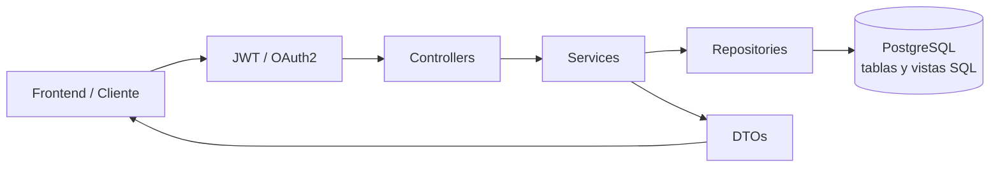

# ApiJuegoInventario

API REST para gestionar el inventario, catálogo y ventas de una tienda. El proyecto permite administrar productos, recibir compras de clientes, consultar métricas y generar reportes en Excel o PDF.

Construido con Java 21, Spring Boot 3.5 y PostgreSQL 16.

## Funcionalidades

- Autenticación con JWT y OAuth2 mediante Google.
- Roles separados para `ADMIN` y `CLIENT`.
- Registro, login y gestión de perfiles.
- Catálogo de productos con categorías, stock, estado e imágenes.
- Carga de imágenes en Cloudinary.
- Gestión de tarjetas simuladas para clientes.
- Flujo de compra con detalle de productos y totales.
- Historial de compras y ventas.
- Dashboard con ventas, productos, clientes y datos mensuales.
- Notificaciones en tiempo real mediante Server-Sent Events.
- Reportes descargables en Excel y PDF.
- Documentación OpenAPI / Swagger.

## Arquitectura

El proyecto sigue una arquitectura por capas:


```mermaid
flowchart LR
    Client[Frontend / Cliente] --> Security[JWT / OAuth2]
    Security --> Controller[Controllers]
    Controller --> Service[Services]
    Service --> Repository[Repositories]
    Repository --> Views[(PostgreSQL<br/>tablas y vistas SQL)]
    Service --> DTO[DTOs]
    DTO --> Client
```

### Patrón Factory para reportes

Los endpoints de reportes no dependen directamente de una implementación concreta. `ReportServiceFactory` selecciona la estrategia adecuada según `FileTypes`:

```text
DashboardController
        |
        v
ReportServiceFactory.getService(type)
        |
        +--> ExcelService --> reporte_usuarios.xlsx
        |
        +--> PdfService   --> reporte_usuarios.pdf
```

Diagrama completo: [secuencia-reportes-factory.html](docs/diagrams/secuencia-reportes-factory.html)

## Stack tecnológico

| Área | Tecnología |
|---|---|
| Lenguaje | Java 21 |
| Framework | Spring Boot 3.5.16 |
| API | Spring Web |
| Persistencia | Spring Data JPA / Hibernate |
| Base de datos | PostgreSQL 16 |
| Seguridad | Spring Security, JWT y OAuth2 Google |
| Imágenes | Cloudinary |
| Excel | Apache POI |
| PDF | OpenPDF |
| Documentación | Springdoc OpenAPI / Swagger UI |
| Contenedores | Docker y Docker Compose |
| Build | Maven Wrapper |

## Requisitos

- Java 21
- Docker Desktop, recomendado para ejecutar la base de datos y la API
- Maven 3.8 o superior si no se usa el wrapper
- Credenciales de Cloudinary y Google OAuth2 para activar esas integraciones

## Configuración

Crea un archivo `.env` en la raíz del proyecto. No subas este archivo al repositorio.

```env
DB_USERNAME=postgres
DB_PASSWORD=tu_password
DB_URL=jdbc:postgresql://localhost:5433/apiproject

JWT_SECRET_KEY=una_clave_secreta_segura
JWT_EXPIRATION_MS=86400000

BASIC_AUTH_USERNAME=admin
BASIC_AUTH_PASSWORD=tu_password_basico

CLOUDINARY_CLOUD_NAME=tu_cloud_name
CLOUDINARY_API_KEY=tu_api_key
CLOUDINARY_API_SECRET=tu_api_secret

GOOGLE_CLIENT_ID=tu_google_client_id
GOOGLE_CLIENT_SECRET=tu_google_client_secret
```

Para ejecución dentro de Docker Compose, la aplicación utiliza internamente `jdbc:postgresql://db:5432/apiproject`; el puerto `5433` es el puerto publicado para conexiones desde el equipo local.

## Ejecución con Docker

Levantar la base de datos y la API:

```bash
docker compose up --build
```

La API quedará disponible en:

- API: http://localhost:8080
- Swagger UI: http://localhost:8080/swagger-ui.html
- Health check: http://localhost:8080/actuator/health
- PostgreSQL desde el host: `localhost:5433`

Detener los servicios:

```bash
docker compose down
```

Para eliminar también el volumen local de PostgreSQL:

```bash
docker compose down -v
```

## Ejecución local

Si PostgreSQL ya está disponible y `DB_URL` apunta a la base correcta:

```bash
./mvnw spring-boot:run
```

En Windows:

```powershell
.\mvnw.cmd spring-boot:run
```

Compilar el proyecto:

```bash
./mvnw clean package
```

Ejecutar pruebas:

```bash
./mvnw test
```

El proyecto requiere Java 21 y Maven 3.8 o superior; estas versiones se validan automáticamente durante el build.

## Endpoints principales

La mayoría de rutas protegidas requieren:

```http
Authorization: Bearer <jwt>
```

| Grupo | Endpoint | Rol | Descripción |
|---|---|---|---|
| Auth | `POST /api/user/login` | Público | Login de administrador |
| Auth | `POST /api/client/login` | Público | Login de cliente |
| Productos | `GET /api/product/activeProducts` | Autenticado | Catálogo activo |
| Productos | `POST /api/product/saveProduct` | ADMIN | Crear producto |
| Productos | `PUT /api/product/update/{id}` | ADMIN | Actualizar producto |
| Compra | `POST /api/sale/purchase` | CLIENT | Crear compra |
| Dashboard | `GET /dashboard-controller/get-data-dashboard` | ADMIN | Métricas del dashboard |
| Reportes | `GET /dashboard-controller/excel` | ADMIN | Descargar Excel |
| Reportes | `GET /dashboard-controller/pdf` | ADMIN | Descargar PDF |
| Ventas | `GET /api/sales-items/show-with-limits` | ADMIN | Consultar ventas paginadas |
| Tiempo real | `GET /api/notification/stream` | ADMIN | Stream SSE de notificaciones |

La lista completa de endpoints y payloads está en [API_FRONTEND_CONSUMPTION.txt](API_FRONTEND_CONSUMPTION.txt) y en Swagger.

## Reportes

Los reportes consultan la vista SQL `report_view_dashboard` y comparten la interfaz `ReportService`.

- `ExcelService` genera archivos `.xlsx` usando Apache POI.
- `PdfService` genera archivos `.pdf` usando OpenPDF.
- `ReportServiceFactory` decide qué implementación utilizar.
- Ambos formatos devuelven una respuesta HTTP con `Content-Disposition: attachment`.

## Base de datos

El esquema se encuentra en [schema-postgres.sql](src/main/resources/db/schema-postgres.sql) e incluye tablas y vistas para:

- Usuarios administradores.
- Clientes y tarjetas de pago simuladas.
- Productos e imágenes.
- Ventas y elementos de venta.
- Dashboard y reportes.

Vistas principales:

- `view_of_sales`
- `view_of_dashboard`
- `clients_summary`
- `view_of_client_history`
- `report_view_dashboard`

## Estructura del proyecto

```text
src/main/java/com/apiproject/
├── config/              Configuración de Spring y seguridad
├── controllers/         Endpoints REST por rol y dominio
├── services/            Lógica de negocio
│   └── reportGenerator/ Generadores Excel y PDF
├── repositories/        Persistencia y proyecciones
├── entities/            Entidades JPA
├── DTOs/                Objetos de entrada y salida
├── security/            JWT, OAuth2 y usuario autenticado
└── exceptions/          Manejo global de errores

src/main/resources/
├── application.properties
├── application-dev.properties
└── db/schema-postgres.sql
```

## Documentación adicional

- [Estructura del proyecto](docs/PROJECT_STRUCTURE.md)
- [Arquitectura del código](docs/Arquitectura%20del%20Código.md)
- [Endpoints de la API](docs/Endpoints%20API.md)
- [Configuración](docs/Configuración.md)
- [Esquema de base de datos](docs/Esquema%20de%20Base%20de%20Datos.md)
- [Diagrama de autenticación](docs/diagrams/authentication.html)
- [Diagrama de reportes con Factory](docs/diagrams/secuencia-reportes-factory.html)

## Seguridad

- Las contraseñas se almacenan usando BCrypt.
- Las rutas se protegen mediante JWT y roles.
- CORS está restringido al frontend local `http://localhost:3000`.
- Las credenciales y secretos se cargan mediante variables de entorno.
- El perfil `security` permite ejecutar OWASP Dependency-Check:

```bash
./mvnw verify -Psecurity
```

## Roadmap

- Filtros avanzados para reportes por fecha, cliente, producto y estado.
- Reportes programados por correo electrónico.
- Generación asíncrona para reportes grandes.
- Historial de reportes generados.
- Alertas de stock bajo y comportamiento anómalo de ventas.
- Exportación adicional a CSV.

## Estado del proyecto

Proyecto en desarrollo, orientado a una API de inventario y ventas extensible para integrarse con un frontend web.

## Licencia

Pendiente de definir.
